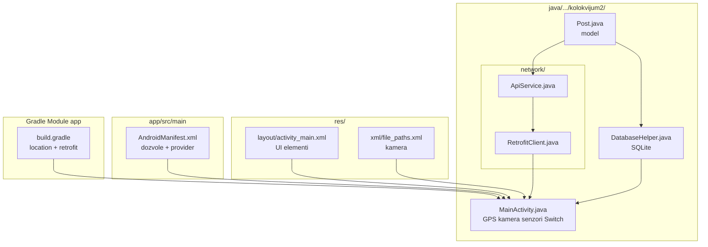

# VODIČ — kako se ponašati na dan kolokvijuma

> **PRVO OTVORI OVAJ FAJL** kad dobiješ zadatak na kolokvijumu.

---

## PRVO OTVORI — redosled MD fajlova

```
DOBIJEŠ ZADATAK
      │
      ▼
┌─────────────────────────────────────┐
│  1. VODIC_DAN_KOLOKVIJUMA.md        │  ← TI SI OVDE (pročitaj zadatak, podvuci reči)
└─────────────────────────────────────┘
      │
      ▼
┌─────────────────────────────────────┐
│  2. SABLON_MASTER_VODIC.md          │  ← nađi reč iz zadatka u tabeli → vidi koji šablon
└─────────────────────────────────────┘
      │
      ├── slično kolokvijumu 2 (GPS+kamera+baza+Retrofit)?
      │         ▼
      │   PRIprema_KOLOKVIJUM_2_KOMPLETNO.md  ← ceo kod, fajl po fajl
      │
      ├── treba brzo, nešto zaboravila?
      │         ▼
      │   VODIC_KOLOKVIJUM_JEDNOSTAVNO.md
      │
      └── samo jedan deo (npr. samo Retrofit)?
                ▼
            SABLON_Retrofit_...md  (ili Layout, Senzori, SQLite...)
```

### U jednoj rečenici

| Korak | Fajl | Zašto |
|-------|------|-------|
| **1** | **`VODIC_DAN_KOLOKVIJUMA.md`** | šta radiš, redosled, šema foldera |
| **2** | **`SABLON_MASTER_VODIC.md`** | tabela: reč u zadatku → koji šablon |
| **3** | **`PRIprema_KOLOKVIJUM_2_KOMPLETNO.md`** | ako je slično kolokvijumu 2 — gotov kod **bez TODO** |
| **4** | pojedinačni `SABLON_*.md` | samo za deo koji radiš (Retrofit, layout...) |
| **?** | **`SABLON_TODO_RECNIK.md`** | ne znaš šta staviti umesto `TODO_...` |
| **?** | **`SABLON_MAPA_KLASA.md`** | ne znaš u koju klasu ide koji kod |

> **Ne otvaraj sve odjednom.** Korak 1 → 2 → onda **jedan** SABLON za deo koji trenutno kucaš.

---

## Šema — gde koji fajl ide (ceo kolokvijum)

> **Paket** u primeru: `com.example.kolokvijum2` — zameni sa svojim ako zadatak kaže drugačije.

### Drvo foldera (kako projekat izgleda na disku)

```
Kolokvijum2/                              ← root projekta (otvori OVAJ folder u Android Studio)
│
├── app/                                  ← modul aplikacije
│   │
│   ├── build.gradle                      ← Gradle Module :app  ★ ZADACI 3, 5
│   │
│   └── src/main/
│       │
│       ├── AndroidManifest.xml           ← dozvole + MainActivity + FileProvider  ★ 3,4,5,7,9
│       │
│       ├── java/com/example/kolokvijum2/
│       │   │
│       │   ├── MainActivity.java         ← SVE: GPS, kamera, senzori, Switch...  ★ 2–9
│       │   ├── Post.java                 ← model JSON sa API-ja  ★ 5, 6
│       │   ├── DatabaseHelper.java       ← SQLite baza postova  ★ 5, 6, 7
│       │   │
│       │   └── network/                  ← desni klik → New → Package → "network"
│       │       ├── ApiService.java       ← Interface, @GET("posts")  ★ 5, 6
│       │       └── RetrofitClient.java   ← BASE_URL servera  ★ 5, 6
│       │
│       └── res/
│           ├── layout/
│           │   └── activity_main.xml   ← UI: TextView, Switch, Button...  ★ 2
│           │
│           └── xml/
│               └── file_paths.xml        ← FileProvider putanje (kamera)  ★ 4
│
├── build.gradle                          ← root — NE diraj dependencies ovde!
└── settings.gradle
```

### Gde to vidiš u Android Studiju (levi panel)

```
Android (view)
├── app
│   ├── manifests
│   │   └── AndroidManifest.xml
│   ├── java
│   │   └── com.example.kolokvijum2
│   │       ├── MainActivity
│   │       ├── Post
│   │       ├── DatabaseHelper
│   │       └── network
│   │           ├── ApiService
│   │           └── RetrofitClient
│   └── res
│       ├── layout
│       │   └── activity_main.xml
│       └── xml
│           └── file_paths.xml
│
└── Gradle Scripts
    └── build.gradle (Module :app)    ← ovde dependencies + Sync Now
```

### Mermaid — fajl → zadatak



### Tabela — putanja → šta ide unutra → zadatak

| Putanja (od `app/`) | Fajl | Šta ide unutra | Zadatak |
|---------------------|------|----------------|---------|
| `build.gradle` | Module :app | `play-services-location`, retrofit, gson | 3, 5 |
| `src/main/AndroidManifest.xml` | Manifest | INTERNET, GPS, CAMERA, CONTACTS, NOTIFICATIONS, FileProvider | 3–5, 7, 9 |
| `src/main/res/layout/activity_main.xml` | Layout | TextView, ImageButton, ImageView, Switch, Button + `@+id/...` | 2 |
| `src/main/res/xml/file_paths.xml` | XML resurs | `<external-files-path>` za slike | 4 |
| `src/main/java/.../MainActivity.java` | Activity | sav Java kod — jedna klasa | 2–9 |
| `src/main/java/.../Post.java` | Model | polja iz JSON + `@SerializedName` | 5, 6 |
| `src/main/java/.../DatabaseHelper.java` | SQLite | tabela `postovi`, dodaj/obriši/prvi | 5–7 |
| `src/main/java/.../network/ApiService.java` | Interface | `@GET("posts")` | 5, 6 |
| `src/main/java/.../network/RetrofitClient.java` | Singleton | BASE_URL sa `/` na kraju | 5, 6 |

### Šta NE praviš (češta greška)

| ❌ Ne pravi | ✅ Umesto toga |
|------------|----------------|
| `MapsActivity.java` | sve u `MainActivity.java` |
| `RetrofitActivity.java` | sve u `MainActivity.java` |
| `model/Post.java` podpaket (nije obavezno) | `Post.java` u glavnom paketu pored MainActivity |
| dependencies u root `build.gradle` | samo u `build.gradle (Module :app)` |
| `<paths>` u Manifest-u | `res/xml/file_paths.xml` |

### Ako zadatak traži SAMO deo (ne sve)

| Zadatak traži | Otvori / napravi samo |
|---------------|------------------------|
| Samo layout | `res/layout/activity_main.xml` + findViewById u MainActivity |
| Samo GPS | Gradle location + Manifest GPS + metode u MainActivity |
| Samo kamera | Manifest + `file_paths.xml` + launcher u MainActivity |
| Samo Retrofit | Gradle + Manifest INTERNET + Post + network + enqueue u MainActivity |
| Samo baza | Post + DatabaseHelper + `dbHelper` u MainActivity |
| Sve kao kolokvijum 2 | **ceo drvo** iznad |

---

## Korak 0 — kad dobiješ zadatak (5 minuta, bez kucanja)

1. **Pročitaj CEo tekst** — ne kreni odmah u Android Studio.
2. **Podvuci reči** u tekstu:

| Ako vidiš... | Znači da treba... |
|--------------|-------------------|
| TextView, Button, Switch, layout | `activity_main.xml` |
| lat/lng, GPS, lokacija | Gradle location + Manifest GPS |
| kamera, slika, ImageView | Manifest CAMERA + FileProvider + kamera kod |
| senzor, žiroskop, akcelerometar | `SensorEventListener` u MainActivity |
| SQLite, baza, obriši, upiši | `DatabaseHelper` |
| Retrofit, HTTP, API, JSON, sajt | `Post` + `network` + Gradle retrofit |
| Switch ON/OFF, prvi put | Switch listener + `vecFetchovano` |
| SharedPreferences, sačuvaj | prefs u Switch OFF |
| kontakti | `READ_CONTACTS` + query |
| notifikacija | `NotificationManager` |

3. Na papir napiši **listu fajlova** koje treba da dirneš (obično 8–10 fajlova).

---

## Korak 1 — redosled rada (uvek ovim redom)

```
1. Novi projekat (Empty Views Activity)
2. activity_main.xml     ← elementi + ID-evi
3. build.gradle + Sync   ← samo ono što zadatak traži
4. AndroidManifest       ← dozvole + FileProvider ako ima kamera
5. file_paths.xml        ← samo ako ima kamera
6. Post, DatabaseHelper  ← samo ako ima baza/API
7. ApiService, RetrofitClient ← samo ako ima Retrofit
8. MainActivity          ← sve ostalo, JEDAN fajl
9. Run + testiraj
```

**Ne preskači Sync** posle Gradle izmene.

---

## Korak 2 — kako radiš MainActivity (najvažnije)

Na kolokvijumu skoro uvek **samo MainActivity**.

```
1. Otvori POSTOJEĆI MainActivity (ne pravi MapsActivity, RetrofitActivity...)
2. Na vrh: fields
3. Launcher za kameru — VAN onCreate
4. Jedan onCreate: findViewById → init → listeneri
5. Metode ispod: GPS, kamera, kontakt...
6. Override: onResume, onPause, onSensorChanged, onRequestPermissionsResult
```

**Ignoriši `TODO_Activity`** u šablonima — to je za vežbe sa više ekrana.

---

## Korak 3 — kad zapneš, pitaj se samo ovo

> **„Da li ovo ide u XML, Gradle, Manifest ili MainActivity?“**

| Problem | Gde gledaš |
|---------|------------|
| Nema elementa na ekranu | XML + findViewById ID |
| App se ne build-uje | Gradle Sync, importi, paket |
| GPS/kamera/internet ne rade | Manifest dozvole |
| Podaci sa sajta | Retrofit fajlovi + INTERNET |
| Logika klika/Switch-a | MainActivity listener |

---

## Korak 4 — koje fajlove otvoriš (sa GitHub-a)

| Situacija | Otvori |
|-----------|--------|
| Ne znaš odakle | `SABLON_MASTER_VODIC.md` |
| Brzo, panika | `VODIC_KOLOKVIJUM_JEDNOSTAVNO.md` |
| Isti tip kao kolokvijum 2 | `PRIprema_KOLOKVIJUM_2_KOMPLETNO.md` |
| Samo layout | `SABLON_Layout_XML.md` |
| Samo Retrofit | `SABLON_Retrofit_HTTP_Zahtevi.md` |
| Layout nije „ispod drugog“ | `SABLON_Layout_XML.md` → sekcija „Ako NE piše jedno ispod drugog“ |
| Šta kopiraš vs menjaš | `SABLON_UNIVERZALNO_VS_KONKRETNO.md` |

**Ne čitaj sve odjednom** — otvori **jedan** fajl za **jedan** deo zadatka.

---

## Korak 5 — testiraj dok radiš (ne na kraju)

| Uradio si... | Test |
|--------------|------|
| Layout | App se pokrene, vidiš elemente |
| GPS | TextView pokaže lat/lng |
| Kamera | Slika + Toast |
| Retrofit | privremeni Toast „Postova: 10“ |
| Switch | ON → fetch; drugi put → Toast title |
| Dugme | briše; prazno → notifikacija |

---

## Korak 6 — šta NE radiš na kolokvijumu

- ❌ Ne lepiš **ceo blok** šablona (npr. ceo KORAK 3 Senzori)
- ❌ Ne praviš **dva `onCreate()`**
- ❌ Ne praviš **novu Activity** ako nije eksplicitno traženo
- ❌ Ne stavljaš **metode unutar `{}` lambde**
- ❌ Ne menjaš **Gradle u root** fajlu — samo `build.gradle (Module :app)`

---

## Ako zadatak NIJE identičan kolokvijumu 2

Isti princip:

1. **UI** → layout (vertical ako ne piše drugačije)
2. **Dozvole** → Manifest
3. **Biblioteke** → Gradle
4. **Podaci** → model + baza + Retrofit (ako treba)
5. **Ponašanje** → MainActivity listeneri

Menjaš **ID-eve, URL, polja modela, tekst Toast-a** — obrazac ostaje.

---

## Jedna rečenica za dan kolokvijuma

**Pročitaj → podvuci reči → otvori odgovarajući šablon → jedan fajl po jedan → sve u MainActivity → testiraj.**

---

## Brza mapa — reč u zadatku → šablon

| Reč u zadatku | Šablon |
|---------------|--------|
| layout, TextView, Button | `SABLON_Layout_XML.md` |
| GPS, lat, lng | `SABLON_Lokacija_GoogleMaps.md` (KORAK 1b) |
| kamera, senzor | `SABLON_Senzori_Kamera.md` |
| baza, SQLite, prefs, kontakti | `SABLON_SQLite_...md` |
| Retrofit, HTTP, API | `SABLON_Retrofit_...md` |
| ceo kolokvijum 2 | `SABLON_KOLOKVIJUM_2.md` |

---

Pred kolokvijum: `git pull` → otvori ovaj fajl pored Android Studija.
